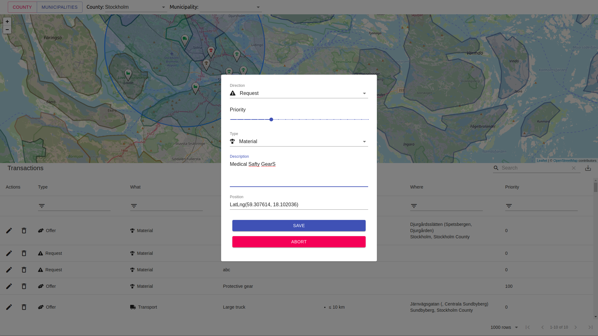

# hackthecrisisswe-covid19

## Problem Description
We have shortages of essential materials and workers.
The public and private sector have some what is needed to tackle this crisis.
How to coordinate materials, transportation and workers problem with logistics for the central authorities/government. When the county and municipalities are the ones who make the dissensions.
What I have researched I have not found any system in place today that help with the logistics and cooperation between the countys.

And the time is critical to save lives. We need a clear and concise platform to coordinate this ASAP.
The problem will be two folded when the safety gear runs on in the hospitals. Both the healthcare worker and patient safety will be compromised. And when the healthcare worker gets sick there will be a bigger shortage in their staff.

## Solution Description
The solution that I have created/visioned is a simple website where anyone can offer material/work/transport/production.
The municipalities will be the ones that will coordinate these.
The county will coordinate the resources in all the municipalities in the county.
And the central government will coordinate the resources between the countys.

For offers the information chain (and permission roles are):
Company/private citizens -> municipalities -> countys -> central government.

Then institutions can make requests of things that are needed for their work.
The municipalities and countys are the one who decides on what action to take .

A request/offer can have constrains attached. Examples:

A worker must have a certificate/education to perform a task
A material must have a safety certification
A delivery have a max distance, weight, volume.

## Action Plan
1. Finish some missing features:
  - User and role handling
  - Improve constraint handling and implement a filter
  - Implement county/municipality
  - Provide more and streamlined information to the user
2. Setup a production VPS server
3. Create a more streamlined form for user to submit offer.
4. Improve gis filtering and polish the application.
